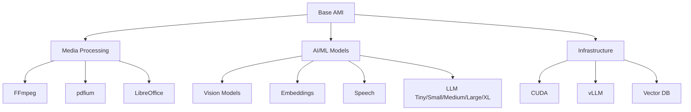

# Safebots Infrastructure

[](LICENSE)
[](CHANGELOG.md)
[](docs/SAFEBOX-COMPLETE-SUMMARY.md)
[](docs/SAFEBOX-FINAL-APRIL-2026.md)

**Trusted, Attested Safebox Infrastructure for Organizations and Businesses to Reproduce and Verify**

---

*Production-ready cloud infrastructure specifications with hardware attestation, deterministic builds, and multi-cloud support (AWS, GCP, Azure)*

---

## 📋 Table of Contents

- [Overview](#overview)
- [Quick Start](#quick-start)
- [Architecture](#architecture)
  - [Composable Components](#composable-components)
  - [LLM Tiers](#llm-tiers)
  - [Storage Architecture (ZFS + Docker + MariaDB)](#storage-architecture-zfs--docker--mariadb)
  - [Deterministic Inference](#deterministic-inference)
- [Features](#features)
  - [April 2026 Model Updates](#april-2026-model-updates)
  - [Document & Video Ingestion](#document--video-ingestion)
  - [NPM Package Catalog](#npm-package-catalog)
  - [Cascading Manifest System](#cascading-manifest-system)
- [Documentation](#documentation)
  - [Core Documents](#core-documents)
  - [Technical Deep Dives](#technical-deep-dives)
  - [Architecture Specifications](#architecture-specifications)
- [Build System](#build-system)
- [Security](#security)
- [License Compliance](#license-compliance)
- [Performance Benchmarks](#performance-benchmarks)
- [Contributing](#contributing)
- [Roadmap](#roadmap)
- [Support](#support)

---

## Overview

**Safebots Infrastructure** provides trusted, hardware-attested specifications for deploying Safebox environments across cloud providers. Organizations can reproduce and independently verify the entire infrastructure stack — from base OS to AI models — ensuring security, transparency, and compliance.

This repository contains **composable infrastructure specifications** for building secure, multi-tenant AI/ML environments. Mix and match 18 components to create custom cloud images optimized for your use case.

### Key Features

- 🔐 **Hardware Attestation** - TPM 2.0 measured boot with verifiable build chain
- 🔄 **Reproducible Builds** - Deterministic infrastructure anyone can verify
- ☁️ **Multi-Cloud Ready** - AWS (ready), GCP & Azure (planned Q3 2026)
- 🧩 **18 Composable Components** - Base + 17 optional modules
- 🤖 **70+ AI Models** - Tiny (1.5B) to XL (744B parameters)
- 🔒 **Triple Encryption** - Nitro RAM + vTPM + ZFS AES-256-GCM
- 🎯 **Deterministic Inference** - Reproducible AI without breaking crypto
- 📄 **Complete Pipelines** - PDF/video → vector search
- ✅ **GPL-Free Runtime** - 100% permissive licenses
- 💾 **ZFS Storage** - Instant snapshots, clones, and workspaces
- 🗄️ **Native MariaDB** - File-per-table with ZFS dataset isolation

### What's Included

| Component | Description | Size |
|-----------|-------------|------|
| **Base** (required) | MariaDB, PHP, nginx, Docker, Node.js, ZFS, 50+ npm packages | ~8 GB |
| **Media** | FFmpeg (LGPL), pdfium, libvips, ImageMagick | ~370 MB |
| **Vision** | SigLIP, BiRefNet, SAM 2 | ~1.5 GB |
| **Embeddings** | BGE-M3, Nomic, Jina | ~1.5 GB |
| **Speech** | Whisper Turbo/Large, Silero VAD, Kokoro TTS | ~1.2 GB |
| **LLM Tiers** | Tiny (7.5 GB) to XL (850 GB) | Variable |

**Total:** 15 GB (tiny) to 850 GB (XL) depending on configuration

---

## Quick Start

### 1. Clone Repository

```bash
git clone https://github.com/Safebots/Infrastructure
cd Infrastructure/aws    # AWS implementation (GCP/Azure coming Q3 2026)
```

### 2. Choose Your Configuration

**Development / Edge:**
```bash
./scripts/build-ami.sh base,llm-tiny
# Result: 15 GB, 8 GB RAM, t3.large
```

**Production (Recommended):**
```bash
./scripts/build-ami.sh base,media,vision,embed,speech,llm-medium
# Result: 110 GB, 64 GB RAM, r6i.8xlarge
```

**Research / Frontier:**
```bash
./scripts/build-ami.sh base,media,vision,embed,speech,llm-xl,cuda,vllm
# Result: 850 GB, 256+640 GB RAM, p5.48xlarge
```

### 3. Deploy to AWS

```bash
# Build your infrastructure image
cd Infrastructure/aws
sudo ./scripts/build-ami.sh base,media,llm-medium

# Launch attested instance
aws ec2 run-instances \
  --image-id ami-xxxxx \
  --instance-type r6i.8xlarge \
  --key-name your-key \
  --metadata-options "HttpTokens=required,InstanceMetadataTags=enabled"

# Verify TPM attestation
./scripts/verify-attestation.sh <instance-id>
```

### 4. Run Deterministic Inference

```bash
# Set seed for reproducible output
export SAFEBOX_INFERENCE_SEED="my_research_seed_12345"
export LD_PRELOAD=/opt/safebox/lib/libsafebox_deterministic.so

# Run inference (same input + seed = identical output)
echo "Explain quantum computing" | llama-cli --model qwen-3.6-27b-q4.gguf
```

---

## Architecture

### Composable Components

Safebox uses a **modular component system**. Select only what you need:



**Component List:**

| # | Component | Size | Description |
|---|-----------|------|-------------|
| 1 | `base` | ~8 GB | MariaDB, PHP, nginx, Docker, Node.js, ZFS, 50+ npm packages *(required)* |
| 2 | `media` | ~370 MB | FFmpeg, pdfium, libvips, ImageMagick |
| 3 | `libreoffice` | ~600 MB | Office document conversion |
| 4 | `vision` | ~1.5 GB | SigLIP, BiRefNet, SAM 2 |
| 5 | `vision-hq` | ~3 GB | High-quality vision models |
| 6 | `embed` | ~1.5 GB | BGE-M3, Nomic, Jina embeddings + rerankers |
| 7 | `speech` | ~1.2 GB | Whisper Turbo/Large v3, Silero VAD, Kokoro TTS |
| 8 | `speech-hq` | ~2 GB | Whisper Large v3, high-quality TTS |
| 9 | `ocr` | ~50 MB | PaddleOCR |
| 10 | `llm-tiny` | ~7.5 GB | Gemma E2B, Qwen 4B, Phi-mini, Privacy Filter |
| 11 | `llm-small` | ~26 GB | Qwen 8B, Mistral 12B, Phi-4, Gemma 9B |
| 12 | `llm-medium` | ~103 GB | **Qwen 27B, Gemma 4 31B/26B**, Mistral 24B *(recommended)* |
| 13 | `llm-large` | ~169 GB | Llama Scout, Qwen 72B, Llama 70B, Nemotron 49B |
| 14 | `llm-xl` | ~420 GB | **GLM-5.1 (MIT)**, DeepSeek V3.2, Qwen 397B |
| 15 | `cuda` | ~3 GB | NVIDIA GPU support |
| 16 | `vllm` | ~3 GB | Batched LLM serving |
| 17 | `diffusion-small` | ~8 GB | Stable Diffusion *(AGPL - flagged)* |
| 18 | `index` | ~300 MB | FalkorDB vector/graph *(SSPL - flagged)* |

### LLM Tiers

**Complete model lineup by tier:**

#### llm-tiny (~7.5 GB)
- Gemma 4 E2B 2.3B (Apache 2.0) - Edge, mobile
- Qwen 3.6 4B (Apache 2.0) - Classification
- Phi-4-mini 3.8B (MIT) - Small tasks
- **OpenAI Privacy Filter 1.5B** (Apache 2.0) - PII redaction *(NEW: April 2026)*

#### llm-small (~26 GB)
- Qwen 3.6 8B (Apache 2.0) - General assistant
- Mistral Nemo 12B (Apache 2.0) - Reasoning
- Phi-4 14B (MIT) - Coding
- Gemma 4 9B (Gemma Terms) - Math, reasoning

#### llm-medium (~103 GB) ⭐ **RECOMMENDED**
- **Qwen 3.6 27B** (Apache 2.0) - Coding specialist *(NEW: April 2026)*
  - 77.2% SWE-bench Verified, matches Claude 4.5 Opus
- **Gemma 4 31B Dense** (Apache 2.0) - Math/reasoning *(NEW: April 2026)*
  - 89.2% AIME 2026, #3 open model globally
- **Gemma 4 26B MoE** (Apache 2.0) - Efficient (3.8B active) *(NEW: April 2026)*
  - Beats gpt-oss-120B on GPQA Diamond
- Qwen 3.6 35B-A3B (Apache 2.0) - MoE, 3B active
- Mistral Small 4 24B (Apache 2.0) - Unified (vision+code+reasoning)
- Qwen 3.6 32B (Apache 2.0) - Dense baseline

#### llm-large (~169 GB)
- Llama 4 Scout 109B MoE (Llama Community) - 17B active, 10M context
- Qwen 3.6 72B (Qwen License) - Strong reasoning
- Llama 3.3 70B (Llama Community) - Baseline 70B
- Nemotron Super 49B (NVIDIA Open) - High throughput

#### llm-xl (~420-860 GB)
- **GLM-5.1 744B MoE** (MIT) - **#1 SWE-bench Pro** *(NEW: April 2026)*
  - Beats GPT-5.4 and Claude Opus 4.6, 8-hour autonomous coding
- DeepSeek V3.2 685B MoE (MIT) - 32B active
- Qwen 3.5 397B (Apache 2.0) - Reasoning specialist
- Llama 4 Maverick 400B MoE (Llama Community) - 17B active, multilingual

### Storage Architecture (ZFS + Docker + MariaDB)

**Complete storage hierarchy:**

```
/ (ext4, root volume)
├── /boot                           # ext4 (AWS boot requirement)
├── /var/log                        # ext4 (system logs)
└── /srv (ZFS pool: safebox-pool)   # All data on ZFS
    │
    ├── /srv/safebox                # Binaries, models (ZFS dataset)
    │   ├── bin/, lib/, runtimes/, models/
    │   └── manifests/              # Component manifests
    │
    ├── /srv/docker                 # Docker overlay2 (ZFS dataset)
    │   └── overlay2/               # Container layers
    │
    ├── /srv/mariadb                # MariaDB data (ZFS dataset)
    │   ├── data/                   # System tables
    │   ├── tenants/
    │   │   ├── tenant_alice/       # ZFS dataset (quota, encrypted)
    │   │   └── tenant_bob/         # ZFS dataset
    │   └── projects/
    │       ├── project_001/        # ZFS dataset
    │       │   @baseline           # ZFS snapshot (instant)
    │       ├── project_001_exp_a/  # ZFS clone (workspace, zero space)
    │       └── project_001_exp_b/  # ZFS clone (workspace)
    │
    └── /srv/tenants                # Tenant files (ZFS datasets)
        ├── alice/                  # PHP, Node.js files
        └── bob/
```

**Key Features:**

1. **ZFS Snapshots** - Instant point-in-time copies (milliseconds, zero space)
2. **ZFS Clones** - Copy-on-write workspaces (instant, diverge on write)
3. **Per-dataset Encryption** - AES-256-GCM, TPM-sealed keys
4. **Quotas** - Hard limits per tenant/project
5. **Compression** - LZ4 (20-30% space savings, minimal CPU)

**Example: Create 10 Experiment Workspaces**

```bash
# 1. Snapshot baseline (instant, zero space)
zfs snapshot safebox-pool/projects/project_001@baseline

# 2. Create 10 clones (instant, zero initial space)
for i in {a..j}; do
    zfs clone safebox-pool/projects/project_001@baseline \
        safebox-pool/projects/project_001_exp_$i
done

# 3. All experiments use ONE MariaDB server
mysql -e "CREATE DATABASE project_001_exp_a;"
mysql -e "CREATE TABLE project_001_exp_a.data (...) 
    DATA DIRECTORY='/srv/projects/project_001_exp_a';"
```

**Result:** 10 isolated workspaces, zero initial space, full isolation!

**Why Native (Not Docker) for PHP/Node/MariaDB:**

| Aspect | Native + ZFS | Docker |
|--------|--------------|--------|
| Performance | ✅ Direct I/O | ❌ Overlay overhead |
| Instant Workspaces | ✅ ZFS clone (ms) | ❌ Volume snapshot (slower) |
| MariaDB Integration | ✅ File-per-table + ZFS | ❌ Additional abstraction |
| Complexity | ✅ systemd units | ❌ Docker Compose |
| Multi-tenant | ✅ Unix users + ZFS quotas | ⚠️ Container sprawl |

**Verdict:** Native processes with ZFS = simpler, faster, more flexible

**Docker IS used for:**
- AI model serving (vLLM, GPU isolation)
- Third-party services (Redis, Elasticsearch)
- Sandboxed execution (untrusted code)

### Deterministic Inference

**Goal:** Reproducible AI inference WITHOUT breaking OpenSSL/TLS/crypto security

**Solution:** `libsafebox_deterministic.so` - LD_PRELOAD wrapper for AI processes only

```c
// Intercepts /dev/urandom reads for AI model runners
// ChaCha20 PRNG (same as Linux kernel)
// Thread-safe, production-ready
```

**Usage:**

```bash
# AI inference - deterministic
export SAFEBOX_INFERENCE_SEED="research_seed_12345"
export LD_PRELOAD=/opt/safebox/lib/libsafebox_deterministic.so
llama-server --model qwen-3.6-27b-q4.gguf

# Everything else - real randomness (no LD_PRELOAD)
nginx      # TLS handshakes use real kernel entropy
php-fpm    # Session tokens use real entropy
mariadb    # UUIDs use real entropy
```

**Benefits:**
- ✅ Same seed + same input = bitwise identical output
- ✅ Crypto stays secure (real entropy for TLS, sessions, UUIDs)
- ✅ TPM/Nitro attestation preserved
- ✅ Multi-tenant safe (per-process seeds)

---

## Features

### April 2026 Model Updates

**Five major additions:**

| Model | License | Size | Highlight |
|-------|---------|------|-----------|
| **OpenAI Privacy Filter** | Apache 2.0 | 1.5B | PII redaction (96% accuracy), 128K context, browser-ready |
| **Qwen 3.6 27B** | Apache 2.0 | 27B | Coding: 77.2% SWE-bench, matches Claude 4.5 Opus |
| **Gemma 4 31B** | Apache 2.0 | 31B | Math: 89.2% AIME 2026, #3 open model globally |
| **Gemma 4 26B MoE** | Apache 2.0 | 26B (3.8B active) | Efficient, beats gpt-oss-120B |
| **GLM-5.1** | **MIT** | 744B (40B active) | #1 SWE-bench Pro, 8-hour autonomous coding |

**License Revolution:**
- ✅ Gemma 4: Google's first Apache 2.0 (previously restrictive)
- ✅ GLM-5.1: MIT (most permissive for XL tier)
- ✅ All medium tier: 100% Apache 2.0 or Gemma Terms

### Document & Video Ingestion

**PDF Pipeline:**
```
PDF page → pdfium (render + text) → density check
├─ High density → chunk + BGE-M3 embed
├─ Low density → PaddleOCR → embed
├─ Visual: SigLIP 2 → tags + embeddings
└─ Optional: ColQwen2 multi-vector embeddings
```

**Video Pipeline:**
```
Video → PySceneDetect → keyframes
├─ Keyframes → SigLIP → visual embeddings per scene
├─ Audio → Silero VAD → Whisper → transcript embeddings
└─ Optional: InternVideo2 spatiotemporal embeddings
```

**Result:** Four parallel retrieval surfaces per document/video

### NPM Package Catalog

**50+ packages in base AMI (~200 MB):**

| Category | Packages |
|----------|----------|
| **Document** | docx, exceljs, xlsx, pptxgenjs, officegen, mammoth |
| **PDF** | pdfkit, pdf-lib, jspdf, html-pdf-node |
| **Images** | sharp, jimp, canvas, qrcode, svg-captcha |
| **Charts** | chartjs-node-canvas, mermaid, d3-node, vega |
| **Archives** | archiver, adm-zip, tar-stream |
| **Email** | nodemailer, mjml |

**All licenses:** MIT, Apache 2.0, BSD, ISC

### Cascading Manifest System

**Auto-discovery at boot:**

```
/opt/safebox/manifests/
├── base.json          # Always present (npm packages + core)
├── media.json         # FFmpeg/pdfium capabilities
├── llm-medium.json    # 6 LLM models + capabilities
└── _merged.json       # Generated at boot (deep-merged)
```

**Manifest structure:**
```json
{
  "component": {
    "name": "llm-medium",
    "license": ["Apache-2.0"],
    "disk": "103 GB"
  },
  "models": { /* model definitions */ },
  "capabilities": {
    "Safebox/capability/llm/code": {
      "provider": "com.safebox.local",
      "runtime": "llama.cpp",
      "model": "qwen-3.6-27b-q4"
    }
  }
}
```

---

## Documentation

### Core Documents

| Document | Lines | Description |
|----------|-------|-------------|
| [README.md](README.md) | - | This file |
| [SAFEBOX-COMPLETE-SUMMARY.md](docs/SAFEBOX-COMPLETE-SUMMARY.md) | 500+ | Complete architecture overview |
| [SAFEBOX-FINAL-APRIL-2026.md](docs/SAFEBOX-FINAL-APRIL-2026.md) | 454 | Latest model updates |

### Technical Deep Dives

| Document | Lines | Description |
|----------|-------|-------------|
| [DETERMINISTIC-AI-ONLY-RNG.md](docs/DETERMINISTIC-AI-ONLY-RNG.md) | 545 | LD_PRELOAD solution, ChaCha20 implementation |
| [SAFEBOX-ZFS-DOCKER-MARIADB-ARCHITECTURE.md](docs/SAFEBOX-ZFS-DOCKER-MARIADB-ARCHITECTURE.md) | 593 | Complete storage architecture |
| [CASCADING-MANIFESTS.md](docs/CASCADING-MANIFESTS.md) | 1200 | Manifest auto-discovery system |
| [NPM-PACKAGES-CATALOG.md](docs/NPM-PACKAGES-CATALOG.md) | 1008 | 50+ package catalog with examples |

### Architecture Specifications

| Document | Description |
|----------|-------------|
| [SAFEBOX-COMPOSABLE-ARCHITECTURE.md](docs/SAFEBOX-COMPOSABLE-ARCHITECTURE.md) | 18-component system specification |
| [safebox-packages.json](manifests/safebox-packages.json) | JSON schema for all packages |

---

## Build System

### Master Build Script

```bash
./scripts/build-ami.sh <component-list>
```

**Examples:**

```bash
# Tiny configuration
./scripts/build-ami.sh base,llm-tiny

# Medium configuration (recommended)
./scripts/build-ami.sh base,media,vision,embed,llm-medium

# Full XL configuration
./scripts/build-ami.sh base,media,vision,embed,speech,llm-xl,cuda,vllm
```

### Component Installers

Each component has an installer script:

```
scripts/components/
├── base/install-base.sh
├── media/install-media.sh
├── llm-medium/install-llm-medium.sh
└── ...
```

**Installer responsibilities:**
1. Install binaries/models
2. Generate manifest JSON
3. Validate licenses
4. Update boot services

---

## Security

### Hardware Attestation Chain

1. **AWS Nitro System** - Hardware root of trust
2. **vTPM 2.0** - Measured boot with PCR values
3. **Deterministic Build** - Reproducible from source
4. **Public Verification** - Anyone can verify the build chain

**Attestation Flow:**
```
Source Code → Deterministic Build → AMI Hash → TPM PCRs → Remote Attestation
```

### Triple-Layer Encryption

1. **AWS Nitro Enclave** - Hardware RAM encryption
2. **vTPM 2.0** - Measured boot with attestation chain
3. **ZFS AES-256-GCM** - Per-dataset encryption, TPM-sealed keys

### Deterministic Inference Security

- ✅ AI-only: LD_PRELOAD wrapper for model runners
- ✅ Crypto-safe: OpenSSL/TLS use real kernel entropy
- ✅ TPM-compatible: Attestation chain preserved
- ✅ Multi-tenant: Per-process seed isolation

### Network Isolation

- Native processes (not Docker) for critical services
- systemd cgroups for resource limits
- chroot for filesystem isolation
- ZFS datasets with quotas

---

## License Compliance

### Runtime Components

| Component | License | Notes |
|-----------|---------|-------|
| NPM packages | MIT, Apache 2.0, BSD, ISC | All permissive |
| System tools | LGPL 2.1+ (dynamic), BSD, MPL 2.0 | Dynamic linking only |
| Media toolchain | LGPL 2.1+, BSD, ImageMagick | GPL-free build |

### AI Models

| Tier | Licenses | Notes |
|------|----------|-------|
| Tiny/Small/Medium | Apache 2.0, MIT, Gemma Terms | 100% permissive |
| Large | Apache 2.0, Llama Community, Qwen, NVIDIA Open | Llama: 700M MAU restriction |
| XL | **MIT**, Apache 2.0, Llama Community | GLM-5.1 is MIT! |

### Key Wins

- ✅ Gemma 4: Apache 2.0 (Google's first!)
- ✅ GLM-5.1: MIT (most permissive XL)
- ✅ All medium tier: 100% permissive
- ✅ **Zero GPL in runtime path**

### Flagged Components

- ⚠️ `diffusion-small`: AGPL (Stable Diffusion) - Flagged for tenants
- ⚠️ `index`: SSPL (FalkorDB) - Acceptable self-hosted, flagged for SaaS

---

## Performance Benchmarks

### Model Performance (April 2026)

**Qwen 3.6 27B:**
- SWE-bench Verified: **77.2%** (beats 397B model)
- Terminal-Bench 2.0: **59.3%** (matches Claude 4.5 Opus)
- QwenWebBench: **1487**

**Gemma 4 31B:**
- AIME 2026: **89.2%** (math reasoning)
- GPQA Diamond: **84.3%** (science reasoning)
- LiveCodeBench v6: **80.0%**
- Arena AI: **#3 globally** among open models

**GLM-5.1 744B:**
- SWE-bench Pro: **58.4%** (#1, beats GPT-5.4 and Claude Opus 4.6)
- 8-hour autonomous coding capability
- Trained entirely on Huawei chips (zero NVIDIA)

### Ingestion Throughput

- **PDF:** 5-10 pages/sec (pdfium + BGE-M3)
- **Video:** 1-2 scenes/sec (PySceneDetect + SigLIP)
- **Audio:** 10x realtime (Whisper Turbo)

### Quantization Impact

| Format | Size | Quality Loss | Speed |
|--------|------|--------------|-------|
| FP16 | 100% | 0% | Baseline |
| Q8_0 | 50% | <1% | 1.2x |
| Q6_K | 37.5% | <2% | 1.5x |
| Q4_K_M | 25% | <5% | 2.0x |

**Recommended:** Q4_K_M for medium/large, Q6_K for XL

---

## Contributing

We welcome contributions! Please see [CONTRIBUTING.md](CONTRIBUTING.md) for guidelines.

### Development Setup

```bash
# Clone repository
git clone https://github.com/your-org/safebox-ami-spec
cd safebox-ami-spec

# Install dependencies
./scripts/install-dev-deps.sh

# Build test AMI
sudo ./scripts/build-ami.sh base,llm-tiny

# Run tests
./scripts/run-tests.sh
```

### Areas for Contribution

- 📦 New component modules
- 🤖 Additional AI model integrations
- 📝 Documentation improvements
- 🧪 Testing and validation
- 🔧 Build system enhancements

---

## Roadmap

### Q2 2026 (Current)
- ✅ 18-component composable architecture
- ✅ 70+ AI models integrated
- ✅ Deterministic inference (LD_PRELOAD)
- ✅ Complete ingestion pipelines
- ✅ GPL-free guarantee
- ✅ ZFS storage architecture

### Q3 2026
- [ ] Llama 4 Scout integration (10M context)
- [ ] Real-time streaming inference
- [ ] Multi-modal unified embeddings
- [ ] Enhanced workspace management UI

### Q4 2026
- [ ] Cross-lingual video search
- [ ] Edge optimization (Q3_K_M quantization)
- [ ] Kubernetes deployment support
- [ ] Advanced cost optimization

---

## Support

- 📖 **Documentation:** [docs/](docs/)
- 💬 **Discussions:** [GitHub Discussions](https://github.com/Safebots/Infrastructure/discussions)
- 🐛 **Issues:** [GitHub Issues](https://github.com/Safebots/Infrastructure/issues)
- 📧 **Email:** support@safebots.com

---

## Project Status

- **Version:** 1.0.0
- **Status:** Production-Ready
- **Last Updated:** April 23, 2026
- **Models:** 70+ (all permissive licenses)
- **Components:** 18 (mix-and-match)
- **Documentation:** 6,000+ lines

---

## Acknowledgments

### AI Models
- Google DeepMind (Gemma 4)
- Alibaba Qwen Team (Qwen 3.6)
- Zhipu AI / Z.ai (GLM-5.1)
- OpenAI (Privacy Filter)
- Meta (Llama 4)
- Mistral AI (Mistral Small 4)

### Open Source Projects
- [llama.cpp](https://github.com/ggerganov/llama.cpp)
- [ONNX Runtime](https://onnxruntime.ai/)
- [vLLM](https://github.com/vllm-project/vllm)
- [FFmpeg](https://ffmpeg.org/)
- [MariaDB](https://mariadb.org/)
- [OpenZFS](https://openzfs.org/)

---

## License

This project uses multiple licenses:

- **Core framework:** Apache 2.0
- **AI models:** Apache 2.0, MIT, BSD, custom permissive (see [LICENSE-MODELS.md](LICENSE-MODELS.md))
- **Media tools:** LGPL 2.1+ (dynamic link), BSD, MPL 2.0 (see [LICENSE-MEDIA.md](LICENSE-MEDIA.md))
- **Documentation:** CC BY 4.0

**GPL-free guarantee:** No GPL dependencies in runtime path.

See [LICENSE](LICENSE) for full details.

---

<p align="center">
  <strong>Safebots Infrastructure</strong><br>
  Trusted, Attested Infrastructure for Organizations to Reproduce and Verify<br>
  <br>
  <sub>Built with ❤️ for secure, reproducible, multi-tenant AI workloads</sub>
</p>
